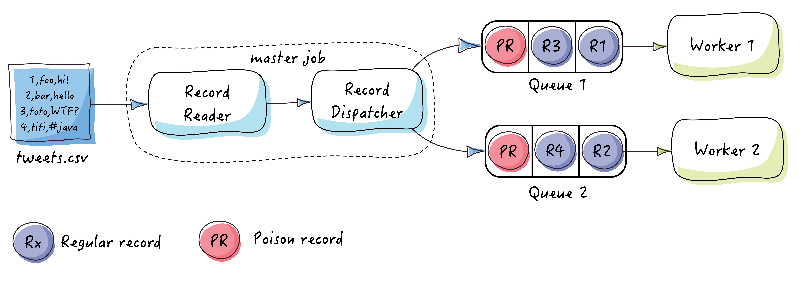

# Parallel jobs Tutorial

## Description

Easy Batch jobs implement the `java.util.concurrent.Callable` interface.
This turns them into units of work that can be submitted to a `java.util.concurrent.ExecutorService`.

Using the `java.util.concurrent.ExecutorService` with a pool of threads, you can run multiple Easy Batch jobs in parallel.
 There are at least 3 ways to process data in parallel:

* Distributing input records to multiple jobs
* Physical partitioning of the data source into multiple physical parts which will be processed by separate jobs
* Logical partitioning of the data source into multiple logical parts which will be processed by separate jobs

In this tutorial, you will see an example of implementing each of these techniques using Easy Batch.

You will reuse the same application developed in the Hello world tutorial but with a huge tweets data source:

```
id,user,message
1,foo,easy batch rocks! #EasyBatch
2,bar,@foo I do confirm :-)
...
10000000,baz,@foo @bar what are you talking about? Am I in trouble?
```

## Dispatching records

In this section, we will create a master job to read data from the data source and distribute records to multiple workers:



The `RecordDispatcher` is actually a record writer that writes records to several queues.
In this tutorial, you will learn how to use the `RoundRobinBlockingQueueRecordWriter` to write tweets to 2 queues.

**NOTE:** Poison records serve as End-Of-Stream messages, they are used to stop the job (gracefully).
The `PoisonRecord` utility class is used to stop the job when all data has been read.
Poison records have no business value, you should filter them using the PoisonRecordFilter.
We will create a "master" job that will read data from the input file and use a `RoundRobinBlockingQueueRecordWriter` to distribute records to "worker" jobs.
Each worker job will read data from a working queue which holds the work that is assigned to it:

```java
public class ParallelTutorialWithRecordDispatching {

    private static final int THREAD_POOL_SIZE = 3;

    public static void main(String[] args) throws Exception {

        // Input file tweets.csv
        File tweets = new File("weets.csv");

        // Create queues
        BlockingQueue<Record> workQueue1 = new LinkedBlockingQueue<>();
        BlockingQueue<Record> workQueue2 = new LinkedBlockingQueue<>();

        // Create a round robin record writer to distribute records to worker jobs
        RoundRobinBlockingQueueRecordWriter roundRobinBlockingQueueRecordWriter =
                new RoundRobinBlockingQueueRecordWriter(asList(workQueue1, workQueue2));

        // Build a master job to read records from the data source and dispatch them to worker jobs
        Job masterJob = aNewJob()
                    .named("master-job")
                    .reader(new FlatFileRecordReader(tweets))
                    .filter(new HeaderRecordFilter())
                    .mapper(new DelimitedRecordMapper(Tweet.class, "id", "user", "message"))
                    .writer(roundRobinBlockingQueueRecordWriter)
                    .jobListener(new PoisonRecordBroadcaster(asList(workQueue1, workQueue2)))
                    .build();

        // Build worker jobs
        Job workerJob1 = buildWorkerJob(workQueue1, "worker-job1");
        Job workerJob2 = buildWorkerJob(workQueue2, "worker-job2");

        // Create a job executor with 3 worker threads
        JobExecutor jobExecutor = new JobExecutor(THREAD_POOL_SIZE);

        // Submit jobs to executor
        jobExecutor.submitAll(masterJob, workerJob1, workerJob2);

        // Shutdown job executor
        jobExecutor.shutdown();

    }

    private static Job buildWorkerJob(BlockingQueue<Record> workQueue, String jobName) {
        return aNewJob()
                    .named(jobName)
                    .reader(new BlockingQueueRecordReader(workQueue))
                    .filter(new PoisonRecordFilter())
                    .processor(new TweetProcessor())
                    .build();
    }

}
```

The record dispatcher dispatches records to a `java.util.concurrent.BlockingQueue`.
We can use the `BlockingQueueRecordReader` to pull records from this queue.
When the master job finishes reading the data source, it sends a PoisonRecord using the `PoisonRecordBroadcaster` to stop worker jobs.

## Run the tutorial

### From the command line

Open a terminal and run the following commands:

```
$>cd easybatch-tutorials
$>mvn install
$> # Launch the record dispatching tutorial
$>mvn exec:java -PrunParallelTutorialWithRecordDispatching
$> # Launch the data source splitting tutorial
$>mvn exec:java -PrunParallelTutorialWithDataSplitting
$> # Launch the data source filtering tutorial
$>mvn exec:java -PrunParallelTutorialWithDataFiltering
$> # Launch the fork/join tutorial
$>mvn exec:java -PrunForkJoinTutorial
```

### From Your IDE

* Import the `easybatch-tutorials` project in your IDE
* Resolve maven dependencies
* Navigate to the `org.easybatch.tutorials.advanced.parallel` package
* Run the `org.easybatch.tutorials.advanced.parallel.ParallelTutorialWithDataFiltering` class without any argument
* Run the `org.easybatch.tutorials.advanced.parallel.ParallelTutorialWithDataSplitting` class without any argument
* Run the `org.easybatch.tutorials.advanced.parallel.ParallelTutorialWithRecordDispatching` class without any argument
* Run the `org.easybatch.tutorials.advanced.parallel.ForkJoinTutorial` class without any argument
